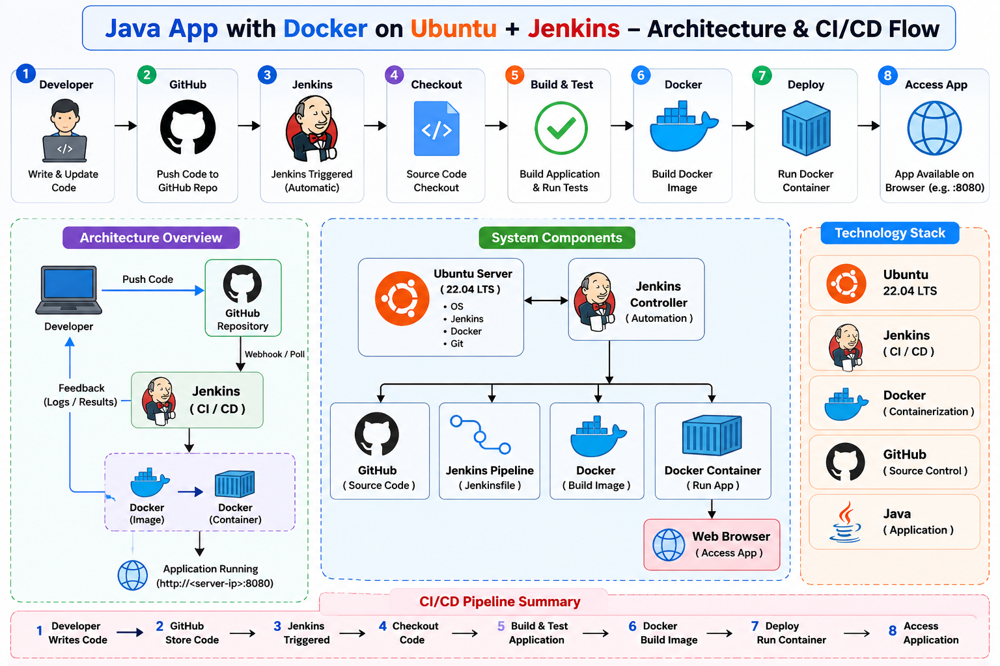
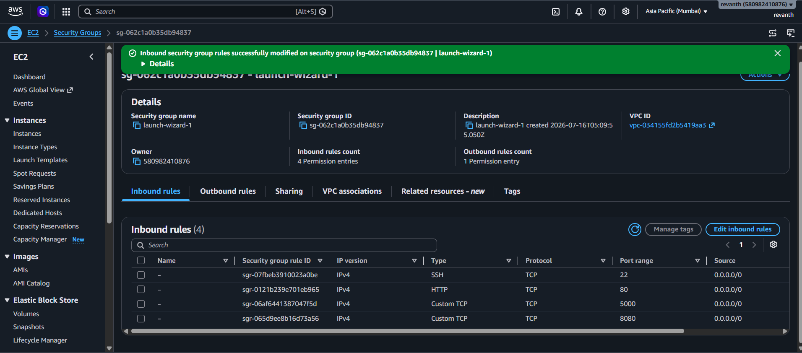
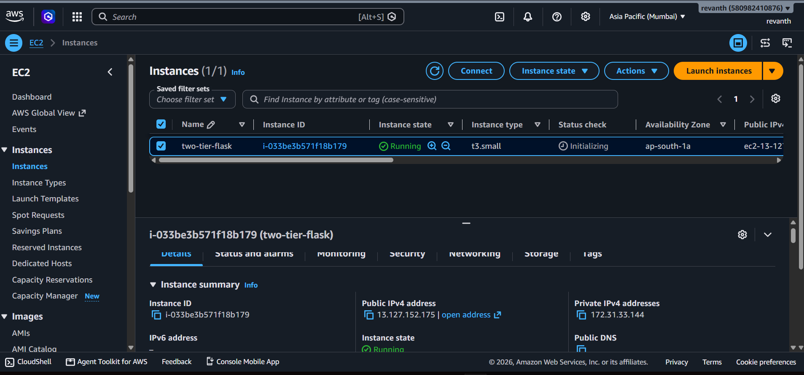
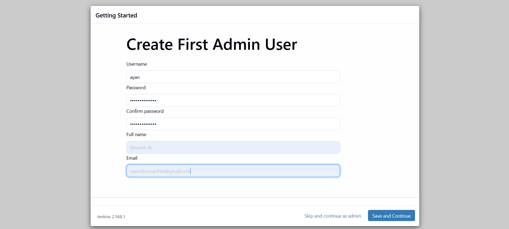
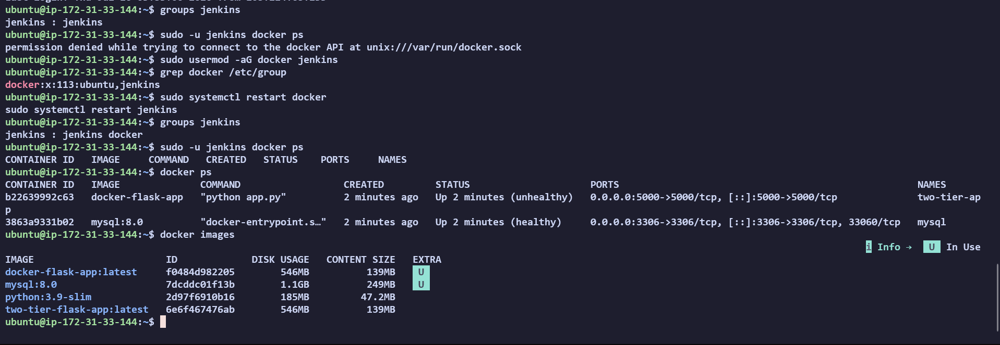
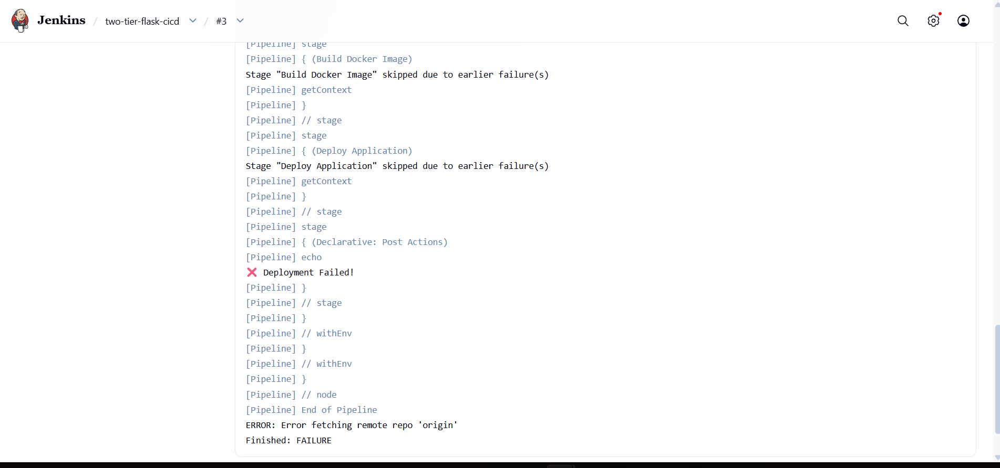
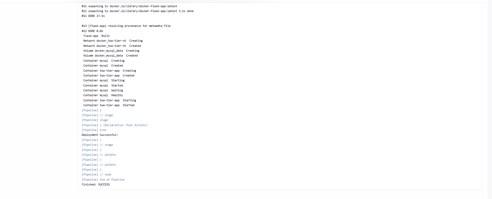
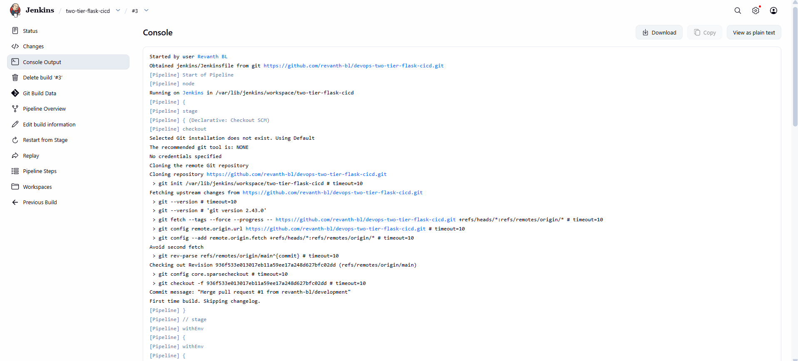
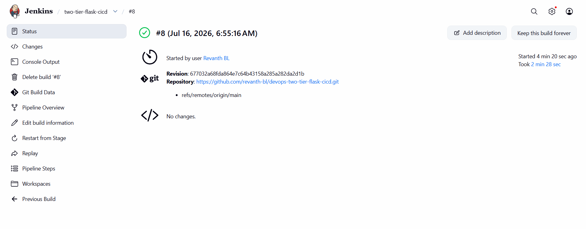
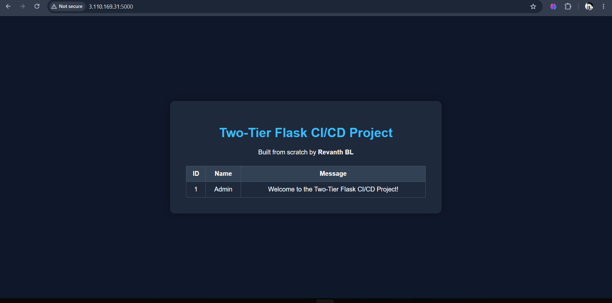

# 🚀 Two-Tier Flask CI/CD Pipeline

> A production-style DevOps project demonstrating a Flask + MySQL application containerized with Docker, automated with Jenkins, validated with GitHub Actions, and deployed on AWS EC2.

[](https://www.python.org/)
[](https://flask.palletsprojects.com/)
[](https://www.docker.com/)
[](https://www.jenkins.io/)
[](https://aws.amazon.com/ec2/)
[](https://github.com/features/actions)
[](https://www.mysql.com/)

---

## 📌 Project Overview

This project demonstrates an end-to-end CI/CD workflow for a two-tier Flask application.

The application consists of:

- A **Flask web application** responsible for the application layer.
- A **MySQL database** responsible for persistent data storage.

The application is packaged using Docker, orchestrated with Docker Compose, automatically built and deployed using Jenkins, validated using GitHub Actions, and hosted on an AWS EC2 Ubuntu server.

The project was built as a practical DevOps project with a focus on real deployment workflows, Linux administration, CI/CD automation, containerization, troubleshooting, and cloud deployment.

---

## 🎯 Project Objectives

- Build a Flask web application.
- Connect Flask with a MySQL database.
- Containerize the application using Docker.
- Orchestrate multiple services with Docker Compose.
- Build a Jenkins CI/CD pipeline.
- Automatically build Docker images.
- Automatically deploy containers.
- Validate the application using health checks.
- Use GitHub Actions for continuous integration.
- Deploy the application on AWS EC2.
- Practice real-world Linux and Jenkins troubleshooting.

---

## 🏗️ Architecture

### High-Level Architecture

```text
                         ┌─────────────────────┐
                         │      Developer      │
                         │                     │
                         │  Write Code         │
                         │  Commit Changes     │
                         └──────────┬──────────┘
                                    │
                                    │ git push
                                    ▼
                         ┌─────────────────────┐
                         │   GitHub Repository  │
                         │                     │
                         │   Source Code       │
                         │   Jenkinsfile       │
                         │   Docker Files       │
                         └──────────┬──────────┘
                                    │
                    ┌───────────────┴────────────────┐
                    │                                │
                    ▼                                ▼
          ┌─────────────────┐              ┌─────────────────┐
          │ GitHub Actions  │              │     Jenkins     │
          │                 │              │   CI/CD Server  │
          │ Validate Code   │              │                 │
          │ Install Python  │              │ Checkout Code   │
          │ Run CI          │              │ Build Image     │
          └─────────────────┘              │ Deploy App      │
                                           └────────┬────────┘
                                                    │
                                                    ▼
                                  ┌────────────────────────────┐
                                  │        AWS EC2              │
                                  │        Ubuntu Linux         │
                                  │                            │
                                  │  ┌──────────────────────┐  │
                                  │  │ Flask Container       │  │
                                  │  │                      │  │
                                  │  │ Application Layer    │  │
                                  │  │ Port: 5000           │  │
                                  │  └──────────┬───────────┘  │
                                  │             │              │
                                  │             ▼              │
                                  │  ┌──────────────────────┐  │
                                  │  │ MySQL Container       │  │
                                  │  │                      │  │
                                  │  │ Database Layer       │  │
                                  │  │ Port: 3306           │  │
                                  │  └──────────────────────┘  │
                                  └──────────────┬─────────────┘
                                                 │
                                                 ▼
                                      ┌─────────────────────┐
                                      │       End User       │
                                      │                     │
                                      │   Flask Application  │
                                      └─────────────────────┘
```

### CI/CD Flow

```text
Developer
    │
    │ Push Code
    ▼
GitHub Repository
    │
    ├──────────────────────────────┐
    │                              │
    ▼                              ▼
GitHub Actions                 Jenkins Pipeline
    │                              │
    │ Validate Application         │ Checkout Source
    │                              │
    │                              ▼
    │                       Build Docker Image
    │                              │
    │                              ▼
    │                       Docker Compose
    │                              │
    │                              ▼
    │                       Deploy Containers
    │                              │
    │                              ▼
    │                       Health Check
    │                              │
    │                              ▼
    └──────────────────────► Deployment Successful
                                   │
                                   ▼
                              AWS EC2 Server
                                   │
                         ┌─────────┴─────────┐
                         ▼                   ▼
                   Flask App             MySQL DB
```

### Architecture Diagram




---

## ✨ Features

- Flask web application.
- MySQL database integration.
- Dockerized application.
- Docker Compose multi-container deployment.
- Jenkins declarative pipeline.
- Automated Docker image builds.
- Automated container deployment.
- GitHub Actions continuous integration.
- AWS EC2 deployment.
- Linux Ubuntu server administration.
- Application health check endpoint.
- REST API endpoint.
- Version endpoint.
- Metrics endpoint.
- Persistent MySQL volume.
- Dedicated Docker network.
- Real-world Jenkins and Docker troubleshooting.

---

## 🛠️ Technology Stack

| Technology | Purpose |
|---|---|
| Python | Application development |
| Flask | Web framework |
| MySQL | Relational database |
| Docker | Application containerization |
| Docker Compose | Multi-container orchestration |
| Jenkins | CI/CD automation |
| GitHub Actions | Continuous integration |
| GitHub | Source code management |
| AWS EC2 | Cloud deployment |
| Ubuntu Linux | Server operating system |
| Git | Version control |

---

## 📂 Project Structure

```text
two-tier-flask-cicd/
│
├── .github/
│   └── workflows/
│       └── ci.yml
│
├── app/
│   ├── app.py
│   └── requirements.txt
│
├── database/
│   └── ...
│
├── docker/
│   ├── Dockerfile
│   └── docker-compose.yml
│
├── docs/
│   └── ...
│
├── diagrams/
│   └── architecture-diagram.png
│
├── jenkins/
│   └── ...
│
├── .env.example
├── .gitignore
├── Jenkinsfile
├── LICENSE
└── README.md
```

---

## 🌐 Application API Endpoints

| Endpoint | Description |
|---|---|
| `/` | Application home page |
| `/health` | Application health check |
| `/api/messages` | Returns application messages |
| `/version` | Displays application version |
| `/metrics` | Displays application metrics |

### Health Check

```bash
curl http://localhost:5000/health
```

Example:

```json
{
  "status": "healthy"
}
```

### API Messages

```bash
curl http://localhost:5000/api/messages
```

### Version

```bash
curl http://localhost:5000/version
```

### Metrics

```bash
curl http://localhost:5000/metrics
```

---

## ⚙️ Local Setup

### Clone the Repository

```bash
git clone https://github.com/revanth-bl/devops-two-tier-flask-cicd.git
cd devops-two-tier-flask-cicd
```

### Create a Python Virtual Environment

```bash
python -m venv venv
```

Linux/macOS:

```bash
source venv/bin/activate
```

Windows PowerShell:

```powershell
venv\Scripts\Activate.ps1
```

### Install Dependencies

```bash
pip install -r app/requirements.txt
```

### Run the Application

```bash
python app/app.py
```

Open:

```text
http://localhost:5000
```

---

## 🐳 Docker Deployment

### Build the Docker Image

```bash
docker build -t two-tier-flask-app -f docker/Dockerfile .
```

### Start the Application with Docker Compose

```bash
docker compose -f docker/docker-compose.yml up -d --build
```

### View Running Containers

```bash
docker ps
```

### View Docker Images

```bash
docker images
```

### View Logs

```bash
docker compose -f docker/docker-compose.yml logs
```

### Stop the Application

```bash
docker compose -f docker/docker-compose.yml down
```

### Stop and Remove Volumes

```bash
docker compose -f docker/docker-compose.yml down -v
```

### Verify the Application

```bash
curl http://localhost:5000/health
```

---

## 🐳 Docker Architecture

The application uses two primary services:

```text
┌─────────────────────────────────────────┐
│              Docker Network             │
│                                         │
│  ┌──────────────────┐                   │
│  │ Flask Container  │                   │
│  │                  │                   │
│  │ Python + Flask   │──────┐            │
│  │ Port 5000         │      │            │
│  └──────────────────┘      ▼            │
│                      ┌──────────────┐   │
│                      │ MySQL        │   │
│                      │ Container    │   │
│                      │              │   │
│                      │ Port 3306    │   │
│                      └──────┬───────┘   │
│                             │           │
│                      Persistent Volume  │
└─────────────────────────────────────────┘
```

The Flask application communicates with MySQL through the Docker Compose network.

The database uses a persistent volume to prevent data loss when the container is recreated.

---

## ☁️ AWS EC2 Deployment

The application is deployed on an Ubuntu EC2 instance.

### Deployment Components

```text
AWS
└── EC2 Instance
    └── Ubuntu Linux
        ├── Docker
        ├── Docker Compose
        ├── Java
        ├── Jenkins
        ├── Flask Container
        └── MySQL Container
```

### Deployment Process

1. Launch an Ubuntu EC2 instance.
2. Configure the EC2 security group.
3. Connect to the server using SSH.
4. Update the Ubuntu package index.
5. Install Docker.
6. Install Docker Compose.
7. Install Java.
8. Install Jenkins.
9. Add the Jenkins user to the Docker group.
10. Clone the GitHub repository.
11. Configure the Jenkins pipeline.
12. Run the pipeline.
13. Build the Docker image.
14. Deploy the containers.
15. Verify the application.

### Connect to EC2

```bash
ssh -i <key-file>.pem ubuntu@<EC2-PUBLIC-IP>
```

### Verify Docker

```bash
docker --version
```

### Verify Docker Compose

```bash
docker compose version
```

### Verify Jenkins

```bash
sudo systemctl status jenkins
```

---

## 🔄 Jenkins CI/CD Pipeline

The Jenkins pipeline automates the deployment process.

### Pipeline Stages

```text
Checkout Source
       │
       ▼
Build Docker Image
       │
       ▼
Deploy with Docker Compose
       │
       ▼
Verify Running Containers
       │
       ▼
Deployment Successful
```

### Jenkins Pipeline Responsibilities

- Checkout source code from GitHub.
- Build the Docker image.
- Start or recreate the application containers.
- Start the MySQL database.
- Verify the deployment.
- Display the running containers.
- Report pipeline success or failure.

### Pipeline Commands

The deployment uses commands similar to:

```bash
docker build ...
```

and:

```bash
docker compose -f docker/docker-compose.yml up -d --build
```

The pipeline then verifies the running services:

```bash
docker ps
```

A successful deployment should show:

```text
two-tier-flask-app
mysql
```

---

## 🤖 GitHub Actions CI

GitHub Actions is used for continuous integration.

The CI workflow performs tasks such as:

- Checking out the repository.
- Installing Python.
- Installing application dependencies.
- Validating the application.
- Running CI checks.

### CI Workflow

```text
Push Code
    │
    ▼
GitHub Repository
    │
    ▼
GitHub Actions
    │
    ├── Checkout Repository
    │
    ├── Setup Python
    │
    ├── Install Dependencies
    │
    └── Validate Application
```

---

## 🔐 Jenkins and Docker Permissions

One of the real deployment issues encountered during this project was Docker permission management.

Jenkins executes pipeline commands using the `jenkins` Linux user.

Docker commands require access to:

```text
/var/run/docker.sock
```

If the Jenkins user does not have permission, the pipeline may fail with:

```text
permission denied while trying to connect to the Docker daemon socket
```

### Solution

Add Jenkins to the Docker group:

```bash
sudo usermod -aG docker jenkins
```

Restart Jenkins:

```bash
sudo systemctl restart jenkins
```

Verify:

```bash
sudo -u jenkins docker ps
```

This allows Jenkins to execute Docker commands inside the pipeline.

---

## 🐞 Real-World Troubleshooting

This project included several practical troubleshooting scenarios.

### Docker Command Not Found

Error:

```text
docker: not found
```

Possible causes:

- Docker was not installed.
- Docker was not available in the PATH.
- Jenkins was executing on a different machine.

Verification:

```bash
which docker
docker --version
sudo -u jenkins which docker
```

---

### Docker Permission Denied

Error:

```text
permission denied while trying to connect to the Docker API
```

Solution:

```bash
sudo usermod -aG docker jenkins
sudo systemctl restart jenkins
sudo -u jenkins docker ps
```

---

### Jenkins Cannot Access Docker

The Docker CLI may work for the Ubuntu user but fail for Jenkins.

The important distinction is:

```text
ubuntu user ≠ jenkins user
```

The Jenkins pipeline executes as:

```text
jenkins
```

Therefore, Docker access must be tested specifically as Jenkins:

```bash
sudo -u jenkins docker ps
```

---

### Docker Compose Installation

Docker Compose V2 can be verified with:

```bash
docker compose version
```

On Ubuntu systems where the package is available:

```bash
sudo apt update
sudo apt install -y docker-compose-v2
```

Verify:

```bash
docker compose version
```

---

### Jenkinsfile Path Issues

Jenkins can fail if the configured Jenkinsfile path does not match the repository structure.

For example:

```text
Jenkinsfile
```

is different from:

```text
jenkins/Jenkinsfile
```

The Jenkins job configuration and repository structure must match exactly.

---

### SSH Private Key Permissions

SSH private keys must have appropriate permissions.

Example:

```bash
chmod 400 key.pem
```

If the key is not found, verify the actual file path:

```bash
ls -la ~/.ssh
```

On Windows with WSL, Windows paths can be accessed through:

```text
/mnt/c/
```

or:

```text
/mnt/e/
```

depending on the drive location.

---

### Git Branch Synchronization

When local and remote branches contain different histories, Git may reject a push.

The repository should be checked carefully before synchronizing:

```bash
git status
git branch
git remote -v
```

---

## 📸 Project Screenshots

The following screenshots document the actual project deployment and CI/CD workflow.

### AWS EC2 Instance



Shows the AWS EC2 instance used to host the Ubuntu server and deployment environment.

### AWS Security Group



Shows the security group configuration used to control inbound access to the EC2 instance.

### Jenkins Dashboard



Shows the Jenkins interface used to manage and execute the pipeline.

### Docker Images and Containers



Shows the Docker image and running containers created during deployment.

### Jenkins Failed



Shows a Failed Jenkins build.

### Jenkins Build Success



Shows the Docker Compose deployment process executed by Jenkins.

### Jenkins GitHub Checkout



Shows Jenkins checking out the source code from GitHub.

### Jenkins Successful Build



Shows the final successful Jenkins build result.

### Deployed Application



Shows the deployed application running successfully.

Shows the flow from source code to automated validation, build, deployment, and the running application.

---

## 📖 Step-by-Step Project Workflow

### Step 1: Create the Application

Create the Flask application and define the required endpoints.

```text
app/
├── app.py
└── requirements.txt
```

### Step 2: Create the Dockerfile

Define the environment required to run the Flask application.

```text
docker/Dockerfile
```

### Step 3: Create Docker Compose Configuration

Define the Flask and MySQL services.

```text
docker/docker-compose.yml
```

### Step 4: Test the Application Locally

Build and run the application:

```bash
docker compose -f docker/docker-compose.yml up -d --build
```

Verify:

```bash
docker ps
```

### Step 5: Create the Jenkinsfile

Define the CI/CD pipeline stages.

The pipeline performs:

```text
Checkout
    ↓
Build
    ↓
Deploy
    ↓
Verify
```

### Step 6: Push the Project to GitHub

```bash
git add .
git commit -m "Add two-tier Flask CI/CD project"
git push origin main
```

### Step 7: Create a Jenkins Pipeline Job

Configure Jenkins to use the GitHub repository and the Jenkinsfile.

### Step 8: Configure the EC2 Server

Install and configure:

- Docker
- Docker Compose
- Java
- Jenkins

### Step 9: Configure Jenkins Docker Access

```bash
sudo usermod -aG docker jenkins
sudo systemctl restart jenkins
```

### Step 10: Run the Pipeline

Jenkins:

1. Checks out the repository.
2. Builds the Docker image.
3. Starts the MySQL container.
4. Starts the Flask container.
5. Verifies the deployment.

### Step 11: Verify the Deployment

```bash
docker ps
```

Then test:

```bash
curl http://localhost:5000/health
```

---

## 🧪 Deployment Verification

A successful deployment should show both application services running.

```text
CONTAINER ID   IMAGE          STATUS          PORTS
xxxxxxxx       docker-flask   Up              0.0.0.0:5000->5000/tcp
xxxxxxxx       mysql:8.0      Up              0.0.0.0:3306->3306/tcp
```

The Jenkins pipeline should finish with:

```text
Finished: SUCCESS
```

The application should then be accessible through:

```text
http://<EC2-PUBLIC-IP>:5000
```

---

## 📊 Observed Successful Deployment

The final deployment successfully demonstrated:

```text
GitHub Repository
        │
        ▼
Jenkins Pipeline
        │
        ▼
Docker Image Build
        │
        ▼
Docker Compose Deployment
        │
        ├── Flask Application Container
        │
        └── MySQL Database Container
        │
        ▼
Application Running on AWS EC2
```

---

## 🧠 Lessons Learned

### Jenkins

- Jenkins pipelines execute commands as the Jenkins Linux user.
- Jenkins must have the correct permissions to access Docker.
- A running Jenkins service does not automatically mean the pipeline environment is correctly configured.

### Docker

- Docker installation and Docker permissions are separate problems.
- The Docker daemon socket controls access to the Docker engine.
- Docker Compose simplifies multi-container deployments.

### Linux

- Users, groups, permissions, and services are essential for DevOps troubleshooting.
- Restarting a service may be required after changing group membership.
- System logs are valuable when diagnosing service problems.

### AWS EC2

- Security groups control network access.
- SSH access requires correct private key permissions.
- EC2 provides the infrastructure, but the server still requires proper configuration.

### Git and GitHub

- Branch synchronization is important.
- Repository structure must match CI/CD configuration.
- Jenkins can automatically retrieve source code from GitHub.

### CI/CD

- Automation reduces manual deployment steps.
- Every stage of the pipeline should be observable.
- Deployment verification is just as important as deployment itself.

---

## 🧩 Challenges Faced

During development, the following issues were encountered and resolved:

- Jenkins GPG key and repository configuration issues.
- Java installation and version configuration.
- Jenkinsfile path mismatch.
- Docker command not found inside Jenkins.
- Docker socket permission denied.
- Jenkins user missing Docker group access.
- Docker Compose installation issues.
- EC2 SSH private key path problems.
- SSH private key permission problems.
- GitHub SSH and HTTPS authentication differences.
- Git branch synchronization issues.
- Docker Compose deployment troubleshooting.

These challenges were valuable because they represented real DevOps problems rather than only theoretical examples.

---

## 🚀 Future Improvements

Planned improvements include:

- Kubernetes deployment.
- Terraform infrastructure as code.
- Prometheus monitoring.
- Grafana dashboards.
- NGINX reverse proxy.
- HTTPS with Let's Encrypt.
- Container image scanning.
- Docker image publishing to a registry.
- Blue-green deployment.
- Rolling deployment strategy.
- Automated integration tests.
- Centralized logging.
- AWS VPC architecture.
- Load balancing.
- Auto Scaling.
- Secrets management.

---

## 🗺️ Possible Production Architecture

The project can be extended into:

```text
                    ┌──────────────┐
                    │   Developer  │
                    └──────┬───────┘
                           │
                           ▼
                    ┌──────────────┐
                    │    GitHub    │
                    └──────┬───────┘
                           │
                 ┌─────────┴─────────┐
                 ▼                   ▼
          GitHub Actions        Jenkins
          Continuous            CI/CD
          Integration              │
                                   ▼
                           Docker Registry
                                   │
                                   ▼
                              AWS ECR
                                   │
                                   ▼
                            Kubernetes
                                   │
                    ┌──────────────┴──────────────┐
                    ▼                             ▼
              Flask Application              MySQL
```

---

## ❓ Interview Questions

### What is a two-tier application?

A two-tier application separates the application layer from the database layer.

In this project:

```text
Flask Application → MySQL Database
```

### Why use Docker?

Docker packages the application and its dependencies into a consistent container environment.

### Why use Docker Compose?

Docker Compose allows multiple services to be defined and managed together.

### Why is Jenkins used?

Jenkins automates the CI/CD workflow, including source checkout, Docker image building, and deployment.

### Why does Jenkins need Docker permissions?

The Jenkins process executes Docker commands. Therefore, the `jenkins` user must be allowed to communicate with the Docker daemon.

### What caused the Docker permission error?

The Jenkins user was not initially a member of the Docker group.

The solution was:

```bash
sudo usermod -aG docker jenkins
sudo systemctl restart jenkins
```

### What is the purpose of the health endpoint?

The health endpoint provides a simple way to verify whether the application is running correctly.

### What is the purpose of GitHub Actions?

GitHub Actions performs continuous integration checks when code changes are pushed.

### Why deploy on AWS EC2?

EC2 provides a cloud-based Linux server on which the application, Docker, and Jenkins can run.

---

## 🤝 Contributing

Contributions are welcome.

### Fork the Repository

```bash
git clone https://github.com/revanth-bl/devops-two-tier-flask-cicd.git
```

### Create a Branch

```bash
git checkout -b feature/your-feature
```

### Make Changes

Implement your improvement or fix.

### Commit Changes

```bash
git add .
git commit -m "Add your feature"
```

### Push the Branch

```bash
git push origin feature/your-feature
```

### Open a Pull Request

Create a pull request with:

- A clear description.
- The reason for the change.
- Testing information.
- Screenshots where applicable.

---

## 📜 License

This project is licensed under the terms of the MIT License.

See:

```text
LICENSE
```

for more information.

---

## 👨‍💻 Author

**Revanth B L**

GitHub:

https://github.com/revanth-bl

LinkedIn:

https://www.linkedin.com/in/revanth-b-l-05294a253/

---

## ⭐ Support

If you found this project useful, consider giving the repository a ⭐ on GitHub.

---

## 📌 Final Summary

This project demonstrates a complete practical DevOps workflow:

```text
Developer
    │
    ▼
Git
    │
    ▼
GitHub
    │
    ├──────────────► GitHub Actions
    │                 │
    │                 ▼
    │              CI Validation
    │
    ▼
Jenkins
    │
    ▼
Docker Image Build
    │
    ▼
Docker Compose
    │
    ├──────────────► Flask Application
    │
    └──────────────► MySQL Database
                           │
                           ▼
                    AWS EC2 Ubuntu
                           │
                           ▼
                    Running Application
```

The project combines application development, containerization, CI/CD automation, Linux administration, cloud infrastructure, and real-world troubleshooting into one complete deployment workflow.
